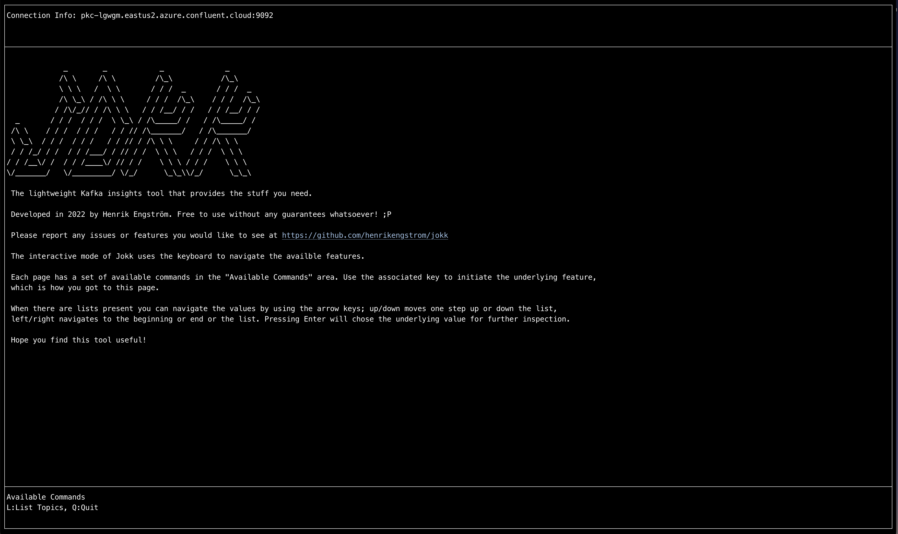

# Jokk

[Jokk/Jåkk](https://en.wiktionary.org/wiki/jokk) is a basic Kafka inspection tool. 

The word `jokk` or `jåkk` is pronounced as you would the word for an enthusiast or participant in a specified activity (i.e. jock).

Jokk means a river or stream in the Samic langague and the name is chosen for this tool since the aim is that it will provide an insight into the stream of data in Kafka.


## Rationale

I have been using Kafka for several years and although there are tools to inspect what is happening inside of Kafka I wanted to build a free-to-use tool that provides the feature set that I am after. That, plus I get to practice my Golang programming skills. Two birds with one stone.

## Getting started

Clone this repo, install [Go](https://go.dev/), and build the repo:

```
cd jokk
go build
```

For more build options see `build.sh`:
```
./build.sh -h
```

### Configuration

First you must let jokk know what Kafka environments you want to inspect. To do so, simply copy the file `jokk.toml.example` to `jokk.toml` and add the required information. The local Kafka environment settings are pre-filled and if you have a local instance running you can access it by setting the environment flag to `-e local`.

## Running Jokk

Jokk supports two modes; **command line mode** and **interactive mode**. The sections below describe how to use each of these modes.

### Command Line Mode

Below is a non=complete list of commands. For a complete list of the available commands type: `./jokk -h`.

Currently issuing the above command will generate the following output:
```
Usage:
  jokk [OPTIONS] <command>

Application Options:
  -c, --credentials-file= File that contains the credentials (default: ./jokk.toml)
  -n, --environment=      Dictates what configuration settings to use (from the jokk.toml file)
  -f, --filter=           Apply filter to narrow search result
  -s, --start-time=       Start time format 'YYYY-MM-DD HH:MM:SS' (not applicable to all commands)
  -e, --end-time=         End time format 'YYYY-MM-DD HH:MM:SS' (not applicable to all commands)
  -r, --record-format=    Formatting to apply when storing messages (JSON/raw) (default: JSON)
  -v, --verbose           Display verbose information when available

Help Options:
  -h, --help              Show this help message

Available commands:
  addTopic        Add a topic to the Kafka cluster
  clearTopic      Clear messages from a topic in the Kafka cluster (use -f/filter to determine topic)
  deleteTopic     Delete a topic from the Kafka cluster (use -f/filter to determine topic)
  importMessages  Import/publish messages to a topic from a file (use -f/filter to determine topic)
  interactive     Interactive mode
  listTopics      List topics and related information
  storeMessages   Store messages from a topic to a file (use -f/filter to determine topic)
  topicInfo       Detailed topic info (use -f/filter to determine topic(s))
  viewMessages    View messages in a topic (use -f/filter to determine topic)
```

The examples below use `-n local` but you can substitute this with whatever environment configurations you have provided in the `jokk.toml` file.

### List topics

```
./jokk -n local listTopics
```

To get a more detailed view run with the verbose (`-v`) flag:
```
./jokk -n local -v listTopics
```

### Topic info

Run the following command to get detailed info about the topic `sometopic`. The `-f` flag stands for filter and it can be used to narrow down what topic you would like to get information about. If no `-f` is available (or more than one topic match the filter) a numbered list will be shown for a quick select.
```
./jokk -n local -f topicx topicInfo
```

Example output:
```
./jokk -n local -f topicx topicInfo
2022-07-11T17:24:51-06:00 INF Welcome to Jokk
2022-07-11T17:24:51-06:00 INF running settings for environment: local
2022-07-11T17:24:51-06:00 INF calling host: localhost:9092
2022-07-11T17:24:51-06:00 INF found more than one topic [2] matching the filter: topicx
2022-07-11T17:24:51-06:00 INF 1: topicx.y
2022-07-11T17:24:51-06:00 INF 2: topicx.z
pick a number (0 to exit): 1
2022-07-11T17:24:52-06:00 INF
+--------------------------------------------+------+------------+-------------+------+-----------------------+--------+-----------+--------+----------+-----+----------+---------+---------+
|                   TOPIC                    | MSGS | PARTITIONS | REPL FACTOR | P ID | P OFFSETS [OLD - NEW] | P MSGS | P % DISTR | LEADER | REPLICAS | ISR | MSGS 24h | MSGS 1h | MSGS 1m |
+--------------------------------------------+------+------------+-------------+------+-----------------------+--------+-----------+--------+----------+-----+----------+---------+---------+
| topicx.y                                   |  0   |     3      |      1      |      |                       |        |           |        |          |     |          |         |         |
|                                            |      |            |             |  0   |   [219259 - 219259]   |   0    |   0.00    |   1    |   [1]    | [1] |    0     |    0    |    0    |
|                                            |      |            |             |  1   |        [0 - 0]        |   0    |   0.00    |   1    |   [1]    | [1] |    0     |    0    |    0    |
|                                            |      |            |             |  2   |        [0 - 0]        |   0    |   0.00    |   1    |   [1]    | [1] |    0     |    0    |    0    |
+--------------------------------------------+------+------------+-------------+------+-----------------------+--------+-----------+--------+----------+-----+----------+---------+---------+P
```

### Add topic

A simple dialogue will guide you through the creation of a topic:
```
 ./jokk -n local addTopic
2022-07-11T17:29:01-06:00 INF Welcome to Jokk
2022-07-11T17:29:01-06:00 INF running settings for environment: local
2022-07-11T17:29:01-06:00 INF calling host: localhost:9092
2022-07-11T17:29:01-06:00 INF topic creation process (enter 0 to exit)
enter topic name: topicx.y
number of partitions: 3
replication factor: 1
2022-07-11T17:29:10-06:00 INF Topic topicx.y created
```

### Delete topic

Similiarly to when adding a topic, the delete topic also runs via a dialogue (note that `-f` can be used to narrow the options down):
```
./jokk -n local -f topicx deleteTopic
2022-07-11T17:31:02-06:00 INF Welcome to Jokk
2022-07-11T17:31:02-06:00 INF running settings for environment: local
2022-07-11T17:31:02-06:00 INF calling host: localhost:9092
2022-07-11T17:31:02-06:00 INF found more than one topic [2] matching the filter: topicx
2022-07-11T17:31:02-06:00 INF 1: topicx.y
2022-07-11T17:31:02-06:00 INF 2: topicx.z
pick a number (0 to exit): 1
2022-07-11T17:31:05-06:00 INF Topic topicx.y deleted
```

### Clear topic

Clears (deletes) existing messages from a topic. This feature uses the existing offsets in partitions to determine what messages should be cleared. This means that if you have incoming messages while running this command there is no way to tell exactly what messages will be deleted and which ones will not (given that there may be newer offsets generated by new messages.) 

```
./jokk -n local -f topicx clearTopic
```

### View messages

Provides a way to peek inside the messages available in a topic. 

```
 ./jokk -n local viewMessages -f topicx -s "2022-07-20 18:00:00" -e "2022-07-20 19:30:00"
2022-07-20T21:04:05-04:00 INF Welcome to Jokk
2022-07-20T21:04:05-04:00 INF running settings for environment: local
2022-07-20T21:04:05-04:00 INF calling host: localhost:9092
2022-07-20T21:04:07-04:00 INF Viewing messages from - to: 2022-07-20 18:00:00 - 2022-07-20 19:30:00
2022-07-20T21:04:07-04:00 INF [Time : Offset: Value] 2022-07-20 18:01:28.971 -0400 EDT : <msg payload>
View another = enter (N to exit):
2022-07-20T21:04:15-04:00 INF [Time : Offset: Value] 2022-07-20 18:01:28.98 -0400 EDT : <msg payload>
View another = enter (N to exit): N
```

### Store messages

Stores messages in a topic in a JSON format to disc.

```
./jokk -n local storeMessages -f topicx -s "2022-07-20 18:00:00" -e "2022-07-20 19:30:00"
2022-07-20T21:07:35-04:00 INF Welcome to Jokk
2022-07-20T21:07:35-04:00 INF running settings for environment: local
2022-07-20T21:07:35-04:00 INF calling host: localhost:9092
Enter a file name to use (.json will automatically be added): test
2022-07-20T21:07:41-04:00 INF Finished writing messages to file: test.json
```

The JSON file content will look like this:
```
[
  {
    "Headers": [],
    "Timestamp": "2022-07-20T18:01:28.971-04:00",
    "BlockTimestamp": "0001-01-01T00:00:00Z",
    "Key": null,
    "Value": <msg payload>,
    "Topic": "topicx",
    "Partition": 0,
    "Offset": 933
  },{
    "Headers": [],
    "Timestamp": "2022-07-20T18:01:28.98-04:00",
    "BlockTimestamp": "0001-01-01T00:00:00Z",
    "Key": null,
    "Value": <msg payload>,
    "Topic": "topicx",
    "Partition": 0,
    "Offset": 934
  },
  ...
]
```

### Import/Publish messages

Imports messages from file to a topic. The layout of the imported file must follow the same as in the store messages output.

```
./jokk -n local importMessages
2022-08-13T18:02:56-06:00 INF Welcome to Jokk
2022-08-13T18:02:56-06:00 INF running settings for environment: local
2022-08-13T18:02:56-06:00 INF calling host: localhost:9092
Enter a file name to use: msg.json
2022-08-13T18:02:58-06:00 INF 1: topicx.y
2022-08-13T18:02:58-06:00 INF 2: topicx.z
pick a number (0 to exit): 1
2022-08-13T18:03:00-06:00 INF Imported 36 messages to topic topicx.y
```

### Interactive Mode

Instead of running every single task from the command line you can start Jokk in so-called interactive mode. This will open a text based UI from which you can run all commands by pressing commands on your keyboard. It's essentially a very basic UI for interacting with the underlying functionality in Jokk. 

```
./jokk -n local interactive
```

This will display something like this:



See the area at the bottom named "Available Commands" for what commands are accessible in the current context.
